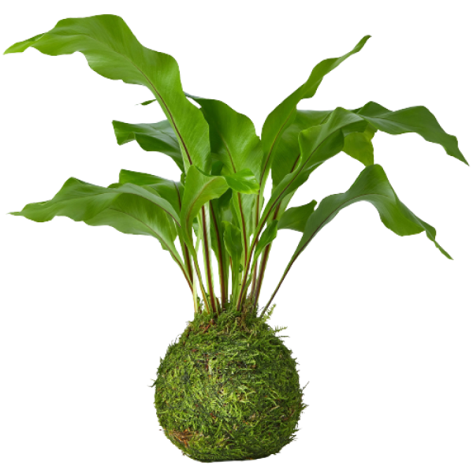

```diff
! This repo is currently a WIP. The readme below was made in anticipation of the completion of this project and is not the final version. Some links may not be active.
```



# E-Commerce: Plant Shop

## :eyes: [View the Live Project]()

## :seedling: About the Collaboration

This project was a collaboration with UX/UI designer [**Tanim Khan**](http://linkedin.com/tanimui). A huge thank you goes to Tanim for being kind enough to let me code a live version of his beautiful e-commerce plant shop design. Tanim's beautiful design can be found on [Dribble](https://dribbble.com/shots/16317978-Plant-Shop-V2-Landing-Page) and [Behance](https://www.behance.net/gallery/126139001/Plant-Shop-V2-Landing-Page). With access to Tanim's figma source file I was able to reproduce a pixel perfect translation of his design.

## :seedling: Technologies Used

[](https://developer.mozilla.org/en-US/docs/Web/Guide/HTML/HTML5) [](https://www.w3schools.com/css/)  [](https://www.javascript.com/) [](https://reactjs.org/)
 [](https://www.heroku.com/)

</section>

## :seedling: Project Purpose


This collaboration allowed me gain valuable experience with:

- Translating Figma designs to code
- Building an e-commerce UI that can be scaled up as needed with the use of React components
